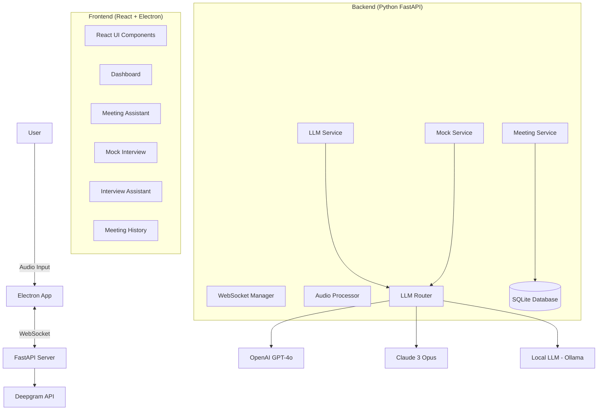
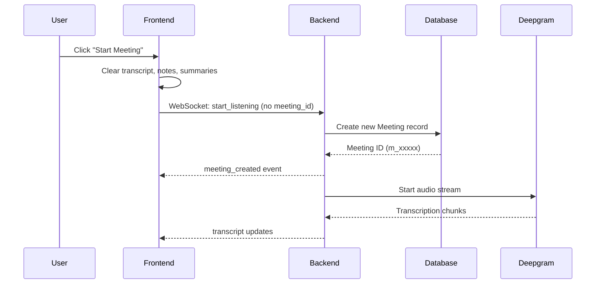
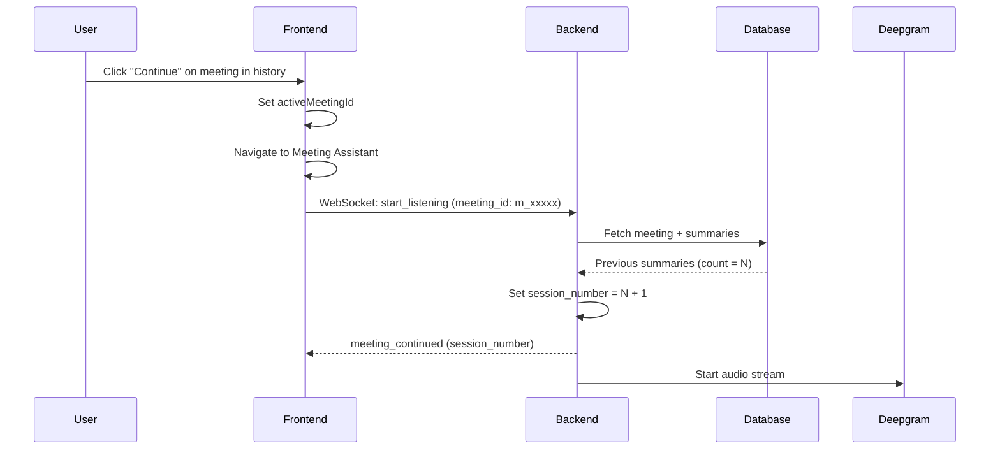
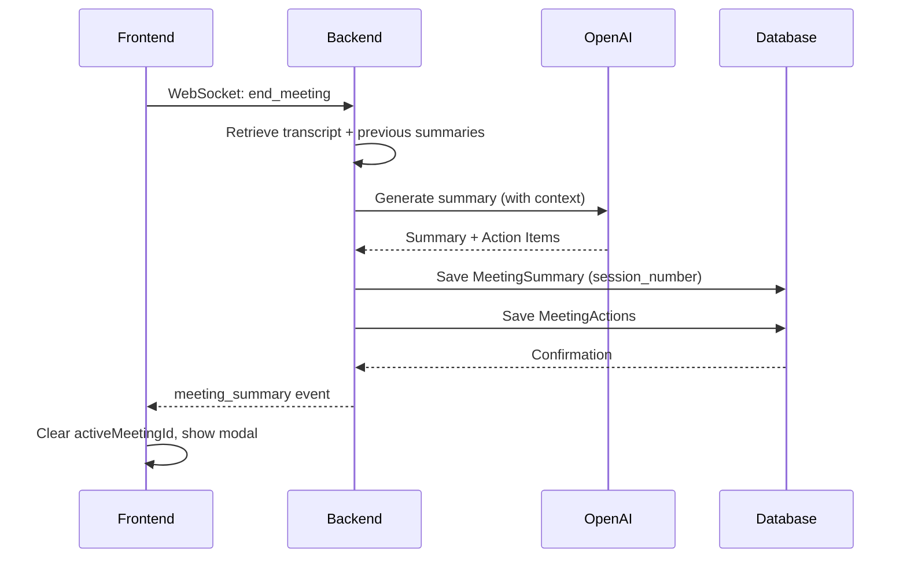

# Amplified - System Design & Architecture Document

## 1. Executive Summary
**Amplified** is an advanced, AI-powered meeting and interview assistant designed to support professionals across three distinct use cases:
1. **Meeting Assistant**: Real-time transcription, summary generation, and action item tracking for productive meetings
2. **Mock Interview Mode**: AI-driven interview practice with feedback and evaluation
3. **Interview Assistant (Stealth Mode)**: Discreet real-time assistance during live interviews

The system leverages real-time audio transcription, Large Language Models (LLMs), persistent storage, and an Electron-based desktop application to provide context-aware intelligence without disrupting workflow.

---

## 2. System Architecture

The application follows a **Client-Server** architecture with **persistent database storage** wrapped in an **Electron** shell for desktop integration.

### High-Level Diagram


### Components

#### A. Frontend (Electron + React)
- **Technology**: React 18, Vite, TailwindCSS (Glassmorphism UI), Electron
- **Role**: Multi-mode UI, audio capture, OS-level integration
- **Key Modules**:
  - `App.jsx`: Main orchestrator with view routing
  - `Dashboard.jsx`: Three-card navigation hub
  - `MeetingAssistant.jsx`: Meeting mode with live transcript, notes, and document upload
  - `MockInterview.jsx`: Practice mode with AI interviewer
  - `InterviewAssistant.jsx`: Stealth mode overlay
  - `MeetingHistory.jsx`: Historical meeting browser with edit, continue, and delete functions
  - `hooks/useWebSocket.js`: Real-time communication hook
  - `hooks/useMockInterview.js`: Mock interview state and logic hook
  - `hooks/useGlobalShortcuts.js`: Global keyboard shortcut management
  - `hooks/useElectronWindow.js`: Electron window state management
  - `components/AppContent.jsx`: Main application logic and state management

**Stealth Features**:
- **Transparency Control**: 0-100% opacity slider
- **Click-Through Mode**: Pass clicks to underlying windows
- **Global Shortcuts**: Quick-trigger assistance

#### B. Backend (FastAPI)
- **Technology**: Python 3.11+, FastAPI, Uvicorn, SQLModel
- **Role**: AI orchestration, audio processing, persistent storage
- **Key Services**:
  - `main.py`: App initialization and middleware
  - `app/routers/`: Modular route handlers (`documents.py`, `meetings.py`, `voice.py`, `interview.py`, `research.py`, `qa.py`, `neural_engine.py`)
  - `app/session_manager.py`: WebSocket session management
  - `app/dependencies.py`: Service dependency injection
  - `audio_processor.py`: Deepgram integration, speaker diarization, filler detection
  - `llm_router.py`: **Central LLM routing service** - routes all AI calls to selected provider (OpenAI/Claude/Local LLM)
  - `llm_service.py`: High-level LLM operations using the router
  - `meeting_service.py`: CRUD operations for meetings, summaries, and action items
  - `mock_service.py`: Mock interview question generation and feedback
  - `models.py`: SQLModel database schema
  - `tests/`: Pytest suite for API verification (`test_health.py`, `test_documents.py`, etc.)

---

## 3. Database Schema

### Models

#### Meeting
```python
class Meeting(SQLModel, table=True):
    id: str (PK)                    # Format: m_{uuid}
    title: str
    start_time: datetime
    end_time: Optional[datetime]
    platform: str                   # e.g., "zoom", "teams", "unknown"
    tags: str                       # Comma-separated for future filtering
    created_at: datetime
    
    # Indexes
    # - user_id (FK)
    # - start_time
    
    # Relationships
    # Relationships (Cascade Delete)
    summaries: List[MeetingSummary]
    actions: List[MeetingAction]
```

#### MeetingSummary
```python
class MeetingSummary(SQLModel, table=True):
    id: int (PK, auto-increment)
    meeting_id: str (FK → Meeting.id, Indexed)
    session_number: int             # 1, 2, 3... for continued meetings
    short_summary: str              # Bullet-point summary
    detailed_summary: str           # Comprehensive paragraph
    created_at: datetime
```

#### MeetingAction
```python
class MeetingAction(SQLModel, table=True):
    id: str (PK)                    # Format: a_{uuid}
    meeting_id: str (FK → Meeting.id, Indexed)
    description: str                # Task description
    owner: str                      # Assigned person
    due_date: Optional[datetime]
    status: str                     # "open", "completed", "cancelled" (Indexed)
    created_at: datetime
```

#### Document
```python
class Document(SQLModel, table=True):
    id: str (PK)
    name: str
    type: str                       # "agenda", "design_doc", "client_doc", "meeting_notes", etc. (Indexed)
    meeting_id: Optional[str] (FK, Indexed)  # Link to specific meeting if applicable
    content_path: Optional[str]     # File path
    extracted_text: Optional[str]   # For RAG/context
    tags: Optional[str]
    created_at: datetime
```

#### VoiceProfile
```python
class VoiceProfile(SQLModel, table=True):
    id: str (PK)                    # Format: vp_{uuid}
    user_id: str (FK, Unique)       # One profile per user
    name: str                       # User's name for transcript display
    embedding_path: str             # Path to voice sample file
    created_at: datetime
```

**Purpose**: Stores user voice enrollment data. When user enrolls with their name, the system displays their name in transcripts instead of generic "Speaker 0" label.

#### UserLLMPreference
```python
class UserLLMPreference(SQLModel, table=True):
    id: int (PK, auto-increment)
    user_id: str                    # Default: "default" (single-user app) (Unique)
    selected_engine: str            # "openai_gpt4o", "claude_3_5_sonnet", "local_llm"

## 📋 Database Schema Updates

- **Indexes added**: `user_id`, `start_time` on `Meeting`; `meeting_id` on `MeetingSummary`, `MeetingAction`, `Document`; `status` on `MeetingAction`.
- **Cascade deletes**: `Meeting` now cascades deletes to `MeetingSummary` and `MeetingAction`.
- **Removed columns**: `updated_at` fields removed from `User`, `JiraSettings`, and `UserLLMPreference`.

## 🛠️ Frontend Refactoring

- New hooks:
  - `hooks/useGlobalShortcuts.js` – global keyboard shortcuts.
  - `hooks/useElectronWindow.js` – Electron window state management.
  - `hooks/useMockInterview.js` – mock interview state logic.
  - `hooks/useWebSocket.js` – real‑time communication.
- New component:
  - `components/AppContent.jsx` – main application logic and state management.
    created_at: datetime
```

**Purpose**: Stores user's selected neural engine (LLM provider). The selected engine is used for all AI operations including suggestions, summaries, mock interviews, and research.

---

## 4. Data Flow & Logic

### A. Meeting Assistant Flow

#### Starting a New Meeting


#### Continuing an Existing Meeting


#### Ending and Summarizing


### B. Mock Interview Flow
1. User provides context (Resume, JD, Role)
2. Backend generates question using LLM with context
3. Frontend uses TTS to speak the question
4. User answers (audio captured and transcribed)
5. Backend evaluates answer using LLM
6. Frontend displays feedback and score

### C. Interview Assistant (Stealth) Flow
1. User enables stealth mode overlay
2. Continuous audio capture and transcription
3. Question detection triggers suggestion generation
4. LLM generates context-aware answer using Resume/JD
5. Answer displayed in transparent overlay

---

## 5. Feature Specifications

### 1. 📝 Meeting Assistant

**Purpose**: Productivity tool for daily meetings

**Capabilities**:
- Live transcription with speaker diarization ("You" vs "Speaker 1")
- Real-time note-taking panel
- Automatic action item detection
- AI-generated summaries (short + detailed)
- Document upload for context:
  - Agenda
  - Design Doc / Spec
  - Client Document
  - Meeting Notes

**State Management**:
- **New Meeting**: Clears all previous state (transcript, notes, summary)
- **Continued Meeting**: Loads meeting ID, increments session number
- Session-based summaries maintain historical context

**Meeting History Features**:
- View all past meetings sorted by date
- Display summaries and action items
- Edit meeting titles inline (hover to reveal edit button)
- Delete meetings
- Continue meetings for follow-up sessions

### 2. 🎭 Mock Interview Mode

**Purpose**: Active practice before real interviews

**Workflow**:
1. Upload Resume + Job Description
2. Optionally research company/role
3. AI generates contextual questions
4. TTS speaks questions naturally
5. Smart listening detects answer completion
6. Instant feedback on structure and content

**Question Types**:
- Behavioral (STAR method)
- Technical (based on JD requirements)
- Situational (hypothetical scenarios)

### 3. 🕵️ Interview Assistant (Stealth Mode)

**Purpose**: Discreet help during live interviews

**Stealth Features**:
- **Ghost Overlay**: 95%+ transparency
- **Click-Through**: Interact with video call behind app
- **Global Shortcuts**: `Cmd+Space` for instant suggestions
- **Contextual Intelligence**: Resume + JD awareness

**Real-Time Coaching**:
- **WPM Gauge**: Visual feedback on speaking pace
- **Filler Counter**: Tracks "um", "uh", "like"

### 4. 🔄 Meeting Continuation System

**Session Tracking**:
- Each meeting can have unlimited sessions
- Each session gets own summary labeled "Session 1", "Session 2", etc.
- Previous summaries included as context for new sessions
- Action items cumulative across all sessions

**Backend Logic**:
```python
# On start_listening with meeting_id:
previous_summaries = get_summaries_by_meeting_id(meeting_id)
session_number = len(previous_summaries) + 1
session["previous_summaries"] = [s.short_summary for s in previous_summaries]

# On generate_summary:
prompt = f"Previous sessions: {previous_summaries}\nCurrent transcript: {transcript}"
```

**Frontend Logic**:
```javascript
// New meeting
activeMeetingId = null → clears all state

// Continue meeting
activeMeetingId = "m_xxxxx" → sends in payload

// After end_meeting
activeMeetingId = null → resets for next fresh start
```

### 5. 🎤 Voice Profile & Name Recognition

**Purpose**: Personalize transcripts by showing user's name instead of generic speaker labels

**Enrollment Flow**:
1. User navigates to Voice Enrollment from Dashboard
2. Records voice sample (minimum ~10 seconds recommended)
3. Enters their name (e.g., "John", "Sarah", "Dr. Smith")
4. System stores voice sample + name in VoiceProfile table
5. Name persists across all future meetings

**Transcript Integration**:
- App fetches VoiceProfile on startup
- `getSpeakerName()` helper maps speaker IDs to names
- Speaker "0" (user) → displays enrolled name
- Other speakers → "Speaker 1", "Speaker 2", etc.
- Transcript styling: User messages on right (blue), others on left (gray)

**Benefits**:
- Professional meeting records with real names
- Easier to review who said what
- Better meeting summaries with named participants
- Enhanced user experience and personalization

---

## 7. Technology Stack

| Component | Technology | Purpose |
|-----------|-----------|---------|
| **Frontend** | React 18 | UI Component Library |
| | Electron | Desktop Integration |
| | TailwindCSS | Styling & Theming |
| | WebSocket | Real-time Communication |
| **Backend** | Python 3.11+ | Server Logic |
| | FastAPI | Async API Framework |
| | SQLModel | ORM + SQLite Integration |
| | Uvicorn | ASGI Server |
| **Database** | SQLite | Local Persistent Storage |
| **AI / ML** | LLM Router | Central routing for multi-provider support |
| | OpenAI GPT-4o | Primary intelligence (default) |
| | Claude 3 Opus | Anthropic's most capable model |
| | Ollama (llama3.2:3b) | Local, private LLM execution |
| | Deepgram Nova-2 | Speech-to-Text |
| **Audio** | MediaRecorder API | Browser Audio Capture |
| | Web Speech API | Text-to-Speech (TTS) |

---

## 7. API Endpoints

### Meeting Management
- `GET /meetings` - List all meetings with summaries and actions
- `GET /meetings/{meeting_id}` - Get specific meeting details
- `PATCH /meetings/{meeting_id}` - Update meeting (e.g., title)
- `DELETE /meetings/{meeting_id}` - Delete meeting and all related data
- `POST /upload/document` - Upload meeting document

### Voice Profile
- `POST /voice-profile/enroll` - Enroll voice with name (multipart: audio file + name)
- `GET /voice-profile` - Get current voice profile
- `DELETE /voice-profile` - Delete voice profile

### Mock Interview
- `POST /mock/question` - Generate interview question
- `POST /mock/feedback` - Evaluate answer

### Research
- `POST /research/company` - Web scraping + LLM analysis
- `POST /research/role` - Role-specific skill extraction

### Neural Engine
- `GET /neural-engine` - Get current user's selected LLM provider
- `POST /neural-engine` - Update user's LLM provider preference

### WebSocket Events
- `start_listening` - Begin audio capture (optional: meeting_id for continuation)
- `stop_listening` - Pause transcription
- `end_meeting` - Generate summary and save
- `generate_suggestion` - Manual trigger for answer
- `handle_stall` - Request filler phrase

---

## 8. State Management

### Session State (Backend)
```python
session = {
    "meeting_id": "m_xxxxx",
    "session_number": 2,
    "previous_summaries": ["Session 1 summary..."],
    "transcript_text": "Full meeting transcript...",
    "is_listening": True,
    "mock_mode": False
}
```

### Application State (Frontend)
```javascript
{
  currentView: 'dashboard' | 'meeting' | 'mock' | 'interview' | 'history',
  activeMeetingId: null | 'm_xxxxx',  // null = new meeting
  sessionNumber: 1,
  transcript: [...],
  notes: '',
  meetingSummary: {...},
  isListening: false
}
```

---

## 9. Security & Privacy

- **Local Processing**: Audio processed in memory, never persisted to disk
- **Database**: SQLite stored locally, no cloud sync
- **API Keys**: Environment variables only, never in code
- **Sessions**: Ephemeral backend sessions, cleared on disconnect
- **Document Storage**: Optional local file storage with extracted text for RAG

---

## 10. Future Enhancements

### Completed ✅
- Meeting session continuations
- Meeting history with summaries
- Action item extraction and display
- Inline meeting title editing
- Meeting document upload (agenda, design docs, etc.)
- Multi-summary support per meeting
- Voice profile enrollment with name
- Speaker name recognition in transcripts
- Modern Glassmorphism UI
- **Neural Engine Selector** - Multi-LLM support (OpenAI/Claude/Local LLM)

### Roadmap 🚧
- [ ] Meeting tagging and filtering
- [ ] Action item status updates and tracking
- [ ] Calendar integration (Google Calendar, Outlook)
- [ ] Meeting templates (standup, 1-on-1, retrospective)
- [ ] Export summaries (PDF, Markdown, Email)
- [ ] Multi-user voice profiles for team meetings
- [ ] Video analysis (facial expressions, eye contact)
- [ ] Custom AI personas for mock interviews
- [ ] Progress analytics and interview score tracking
- [ ] Meeting search and full-text indexing

---

## 11. Performance Considerations

### Audio Processing
- **Chunk Size**: 250ms intervals for smooth transcription
- **Compression**: Opus codec at 16kHz for optimal quality/bandwidth

### Database
- **Eager Loading**: Use `selectinload()` for relationships to avoid N+1 queries
- **Indexing**: Strategic indexes on foreign keys and sort columns (11 total)
- **Cleanup**: Database-level cascade deletes prevent orphaned records

### Frontend
- **State Management**: Minimize re-renders with useCallback/useMemo
- **Transcript Merging**: Combine consecutive same-speaker messages
- **Lazy Loading**: Meeting history pagination for large datasets

---

## 12. Error Handling

### Backend
- Graceful LLM failures (fallback summaries)
- Deepgram connection recovery
- Database transaction rollbacks
- Detailed logging with log levels

### Frontend
- WebSocket reconnection logic
- User-friendly error messages
- Fallback UI states for loading/errors
- Console logging for debugging

---

## 13. CI/CD Pipeline

### GitHub Actions
- **Workflow**: `.github/workflows/api-tests.yml`
- **Triggers**: Push to `main`/`master`, Pull Requests
- **Jobs**:
  - `test`: Runs on `ubuntu-latest`
  - Sets up Python 3.11
  - Installs dependencies (`requirements.txt`)
  - Executes `pytest -v tests/`

---

**Last Updated**: 2025-11-24
**Version**: 2.2
